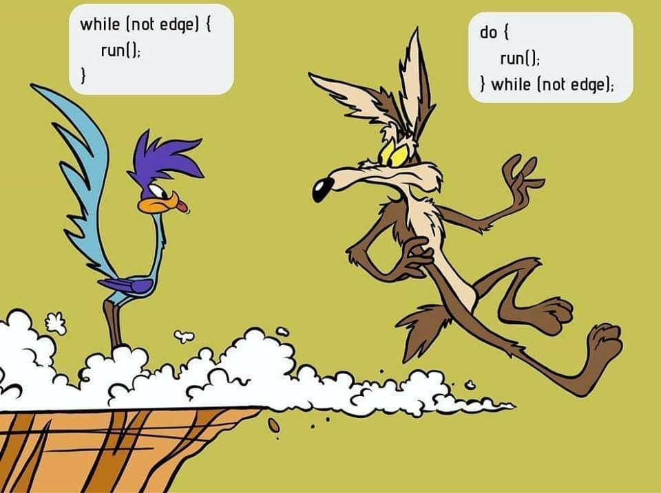

<h1 align="center">C++ Notes</h1>

<hr>

<p align="center"></p>

<hr>


<hr>

# Introduction

<hr>

- Created by **Bjarne Stroustrup**

<hr>


<hr>

# Hello World

<hr>


<hr>

- Here is a sample hello world program in order to understand the syntax of a C++ program

<hr>

```cpp
#include<iostream> // Library which has standard standard input output definitions
                     // Blank lines have no effect on prog. They are put to improve readability
int main(void){ // defining a function named main, with int return type. This function runs automatically without even calling

// Void keyword simply means that we are passing nothing as an argument in this function

    std::cout << "Hello World"; // cout is the function used in order to output something
    // std::cout actually stands for standard character output
    // Semicolons are very necessary to separate one line of code from the other

    return 0; // Any int except 0 can also be returned
}
```

<hr>

- `cout` is a part of standard library, and all the elements in the standard library are declared within what's called a namespace : the namespace `std`.
- Instead of writing `std::cout` always, we may also write the above code as follows:

<hr>

```cpp
#include<iostream>

using namespace std;
//using namespace std means that we can use names for objects and variables from the standard library.

int main(void){

    cout << "Hello World";
    return 0;
}
```

<hr>

# Namespaces

<hr>

## Requirement Of Namespaces

<hr>

- Only one entity can exist with a particular name in a particular scope.
- But non-local variables bring more collision especially considering that libraries may declare many functions, types, and variables, neither of them local in nature.
- So, namespaces allow us to group named entities that otherwise would have global scopes.

<hr>

# New Line

<hr>

- To insert a blank line in C++, we may either use `\n` or the keyword `endl`.

<hr>

```cpp
#include<iostream>

int main(void){

    std::cout << "This is the first line\nAnd this is the second line";

    return 0;
}
```

<hr>

OR

```cpp

#include<iostream>

int main(void){

    std::cout << "This is the first line"<<endl << "This is the second line";

    return 0;
}
```

<hr>

# Setw Manipulator

<hr>

- By default when we print a string or an int in C++, the the output is only as wide as the width of the item to be printed.
- Ex: Printing `Sam` in output will occupy only 3 spaces.
- But suppose if we wanna print a table as I tried in the following program

<hr>

```c++
#include<iostream>
#include<iomanip>

using namespace std;

int main(void){

    cout << "Name" << "\t"<<"Class" <<endl<< "Sam"<< "\t"<<10;

    return 0;
}
```

<hr>

- But unfortunately the format in which the above program prints the table is not very visually clear as attractive.
- Hence we use `setw` operator which can add more than the required spaces, and align the content to the right.
- Here's a program which prints the same table using `setw` operator

<hr>

```c++
#include<iostream>
#include<iomanip>

using namespace std;

int main(void){

    cout << "Name" << setw(8) << "Class" <<endl<< "Sam"<< setw(8)<< 100;

    return 0;
}
```

<hr>

## Endl Vs \n

<hr>

- Performance wise `\n` is considered as a better option because `endl` keeps flushing the queue in the output buffer throughout the process.
- So try using `\n` until and unless flushing the queue in the output buffer is not a necessity.
- The endl manipulator produces a newline character, exactly as the insertion of '\n' does; but it also has an additional behavior: the stream's buffer (if any) is flushed, which means that the output is requested to be physically written to the device, if it wasn't already. This affects mainly fully buffered streams, and cout is (generally) not a fully buffered stream. Still, it is generally a good idea to use endl only when flushing the stream would be a feature and '\n' when it would not. Bear in mind that a flushing operation incurs a certain overhead, and on some devices it may produce a delay.

<hr>

- And wanna inform that in order to print a tab space (4 spaces), we can also use `\t`

<hr>

# Raw Strings

<hr>

- Suppose if we wanna print following sentence: `I am printing \n, \a, \t, and all the rest escape characters`
- Then one way to print this statement is to use `\\` in order to ignore a single slash followed by n, a, t to be considered as an escape sequence, as follows:

<hr>

```c++
#include<iostream>
#include<string>

using namespace std;

int main(void){

    cout << "I am printing \\n, \\a, \\t, and all the rest escape characters";

    return 0;
}
```

<hr>

- Instead of using `\\` all the time in order to ignore the escape sequences, we may use raw string feature that C++ offers
- So we put the string that we wanna print in `R"(put_the_text_over_here)"`

<hr>

```c++
#include<iostream>
#include<string>

using namespace std;

int main(void){

    cout << R"(I am printing \n, \a, \t, and all the rest escape characters)"; // Used the raw string feature

    return 0;
}
```

<hr>

- **Note**: All escape characters are CHARACTERS, not strings event though they have 2 chars

<hr>

# Comments

<hr>

- Comments are the lines which we include in our program for explanation, but are not executed by the compiler.
- There are 2 types of comments:

<hr>

- Single line comments
- Multiline comments

<hr>

## Single Line Comments

<hr>

- If we wanna comment out a single line, then putting `//` is enough.

<hr>

```cpp
#include<iostream>

int main(void){

    // This is a single line comment

    return 0;
}
```

<hr>

## Multi Line Comments

<hr>

- Used in order to comment out multiple lines

<hr>

```cpp
#include<iostream>

int main(void){

    /*
    This is the example of multiline comment
    Here I can comment multiple lines without putting // all the time
    */

    return 0;
}
```

<hr>

# C++ Variables

<hr>

- In C++ there are different types of variables

<hr>

- **int**: Used to store integers
- **double**: Stores floating point numbers
- **char**: Store single characters like 'A' or 'b'. **Chars are always surrounded by single quotes**
- **strings**: Stores text, such as "Hello world". **String values are surrounded by double quotes**
- **bool**: Stores values with 2 states: **true** or **false**.

<hr>

# Declaring Variables

<hr>

- Syntax: `type name = value;` and this may also work: `type name;`

<hr>

```cpp
#include<iostream>

int main(void){

    int integer1 = 5;
    int integer2;

    integer2 = 10;
}
```

<hr>

- Variables can also be declared in this syntax: `type variable_name(variable_value)`

<hr>

```cpp
#include<iostream>
#include<string>

using namespace std;

int main(void){

    int x(0);

    cout << x;

    return 0;
}
```

<hr>

- And declaration is also possible in this way: `type variable_name {initial_value}`

<hr>

```cpp
#include<iostream>
#include<string>

using namespace std;

int main(void){

    int x {0};

    cout << x;

    return 0;
}
```

<hr>

# Type Auto Detection

<hr>

- If we don't know which type of value a variable's gonna inherit, then we can command C++ to detect the type automatically

<hr>

```c++
#include<iostream>
#include<string>

using namespace std;

int main(void){

    auto a = "Sam"; // use auto instead of a fixed type

    cout << a;

    return 0;
}
```

<hr>

- Now suppose if we wanna declare a variable `b` which should be of the same type that of `a`, but we are not sure the type variable `a`'s gonna inherit.
- Then we use `decltype` as used below:

<hr>

```c++
#include<iostream>
#include<string>

using namespace std;

int main(void){

    auto a = "Sam";

    cout << a;

    decltype(a) b;

    a = "Angel";

    cout << "\n"<< a;

    return 0;
}
```

<hr>

# Constant Variables

<hr>

- In order to prevent the value of a declared variable get changed in the future, we use the `const` keyword

<hr>

```c++
#include<iostream>
#include<string>

using namespace std;

int main(void){

    const int pi = 3.141;
    // pi = 6; // results in error

    cout << pi;

    return 0;
}
```

<hr>

# Display Variables

<hr>

- In order to print the variables, this is the way:

<hr>

```cpp
#include<iostream>

int main(void){

    int a=5;
    std::cout<<"Value of a variable: " << a;

    return 0;
}
```

<hr>

# Declaring Multiple Variables

<hr>

- We can also declare multiple variables at the same time, as follows:

<hr>

```cpp
#include<iostream>

int main(void){

    int integer1 = 1, integer2 = 2, integer3 = 3, integer4 = 4;

    return 0;
}
```

<hr>

# Preprocessor Definitions

<hr>

- Another mechanism to name a constant value is to use preprocessor definitions
- Syntax is `#define identifier replacement`
- So after this definition, all the places where mentioned `identifier` appears, will get replaced by the replacement we've mentioned

<hr>

```c++
#include<iostream>
#include<string>
#define Pi 3.14159 // preprocessor definitions

using namespace std;

int main(void){

    cout << Pi * 3;

    return 0;
}
```

<hr>

# Identifiers

<hr>

- Variable names are what's known as identifiers.
- Variables can't be given arbitrarily any name. Here are the naming rules:

<hr>

1. Names can contain only letters, digits, and underscores.
2. Names must begin only with a letter or an underscore.
3. Identifiers are case sensitive. (So abc, and Abc are different identifiers)
4. Names cannot contain whitespaces, or special characters like !, #, %, etc.
5. Reserved words like `int`, `float`, `long` can't be used as identifiers.

<hr>

# C++ Constants

<hr>

- In order to restrict the change of value of a variable, we may use `const`.

<hr>

```cpp
const int integer1 = 5;

integer1 = 10; // Would result in an error as integer1 should always be constant
```

<hr>

# C++ User Input

<hr>

- In order to get the user input, we use `std::cin` function.

<hr>

```cpp
#include<iostream>

int main(void){

    int integer1;

    std::cout << "Kindly enter the input: ";
    std::cin >> integer1;

    std::cout << "\nThe inputted integer is: "<<integer1;
}
```

<hr>

- **Note**: For `cin`, the delimiter is space(` `), so if you would input a string ex "Myself Sam", then the variable would only be storing "Myself"
- In order to avoid this problem, we use `getline`

<hr>

# Getline

<hr>

- Used to get inputs where space is also present

<hr>

```cpp
#include<iostream>
#include<string>

int main(void){

    std::string stringA;

    std::cout <<"\nKindly enter your name: ";
    std::getline (std::cin, stringA);
}
```

<hr>

# Byte Size Of Data Types

<hr>

| Data Type | Size    |
| --------- | ------- |
| int       | 4 bytes |
| float     | 4 bytes |
| double    | 8 bytes |
| boolean   | 1 byte  |
| char      | 1 byte  |

<hr>

# Float Vs Double

<hr>

- Both of them are used to store floating point numbers, but the precision of _float_ is only 6 or 7 decimal digits, while _double_ variables have a precision of about 15 digits.

<hr>

- A floating point number can also be a scientific number with an `e` to indicate the power of 10.

<hr>

```cpp
#include<iostream>

int main(void){

    float f1 = 35e3;
    double d1 = 12E4;
    cout << f1;
    cout << d1;

    return 0;
}
```

<hr>

# Namespaces

<hr>

- Variables are of two kinds: `global` and `local`
- `global` variables are those which can be accessed from anywhere. (Even from outside the block)
- `local` variables are those which can be accessed only from inside the block.
- Here's an example of a local variable named `localVariables` and a global variable named `globalVariable`

<hr>

```c++
#include<iostream>
#include<string>

using namespace std;

int main(void){

    int globalVariable = 200;

    {
        int localVariable = 100;
        cout << "\nThis is a local variable inside the block: " << localVariable;
        cout << "\nThis is a global variable inside the block: " << globalVariable;
    }

    cout << "\nThis is the global variable outside the block: " << globalVariable;
    // cout << "\nThis is the local variable outside the block: " << localVariable; // This line will produce an error as localVariable wasn't declared in this scope

    return 0;
}
```

<hr>

- **Note**: Global variables are altered permanently if they get from even inside the block.
- Here's an example where we change the value of `globalVariable` from inside the block:

<hr>

```c++
#include<iostream>
#include<string>

using namespace std;

int main(void){

    int globalVariable;

    globalVariable = 100;

    cout << "\nOutside the block, and before the block code: "<< globalVariable;

    {

        cout << "Altering the value of globalVariable to 50...";

        globalVariable = 50;

        cout << "\nInside the block: " << globalVariable;
    };

    cout << "\nOutside the block and after the block code: " << globalVariable;

    return 0;
}
```

<hr>

# C++ Booleans

<hr>

- `true` is 1, while `false` is 0

<hr>

```cpp
#include<iostream>

int main(void){

    bool trueVariable = true;
    bool falseVariable = false;

    std::cout << "The true variable is: "<< trueVariable<<" The false variable is: "<< falseVariable;
    // Output is The true variable is: 1 The false variable is: 0
}
```

<hr>

**Note**: Comparison operators always return 1(true) and 0(false) as output.

<hr>

# C++ Chars

<hr>

- This datatype is used to store only a single character, enclosed within single quotes.
- **Note**: We can use ASCII values to display certain characters.

<hr>

```cpp
#include<iostream>

int main(void){

    char value1 = 65, value2 = 70;
    std::cout<<"The value of value1 variable: "<<value1<< " Value of value1 variable: "<<value2;
}
```

# C++ Strings

<hr>

- This is not a built-in datatype in C++
- To use it we need to include the string header file

<hr>

```cpp
#include<string>
```

<hr>

## Creating A String

<hr>

```cpp
#include<iostream>
#include<string>

int main(void){

    std::string stringA = "Sam Varghese";
    std::cout << "Value of stringA: "<<stringA;
}
```

<hr>

- Strings can also be created through the following way: `const char* stringName = "string";` instead of using the string library

<hr>

```c++
#include<iostream>
#include<string>

using namespace std;

int main(void){

    const char *string = "Myself Sam";

    cout << string;

    return 0;
}
```

<hr>

## Cases where you might prefer char* over std:string

<hr>

- When dealing with lower level access like talking to the OS, but usually, if you’re passing the string to the
OS then std::string::c_str has it covered.
- Compatibility with old C code (although std::string’s c_str() method handles most of this).
- To conserve memory (std::string will likely have more overhead).

<hr>

```cpp
#include<iostream>

int main(void){

    std::cout << (5>6); // Output is 0
}
```

<hr>

- **Note**: `%` gives remainder
- **Note**: If division is done among 2 ints, then result will always be an int
- **Note**: If any one of the 2 dividing nos is float, then result is float.
- **Note**: `i++` in C++ means `i = i + 1` which is also equivalent to writing `i += 1` which is again equivalent to `++i`

<hr>

# i++ vs ++i

<hr>

- Though both the expressions do the exactly similar thing, still there's a very imp difference between them
- Firstly, `i++` is called post increment
- `++i` is called pre increment
- Post increment increments later, uses first.
- Pre increment increments first, and then uses it.
- `i++` adds later, while `++i` firstly adds, then returns the final value.
- Difference can be better understood with the following ex

<hr>

```c++
x = 3;
y = ++x;
// x contains 4, y contains 4
```

<hr>

```c++
x = 3;
y = x++;
// x contains 4, y contains 3
```

<hr>

# Comma Operator

<hr>

```c++
#include<iostream>
#include<string>

using namespace std;

int main(void){

    int a = 5;

    int b = (a = 6, ++a); // Will explain this expression

    cout << b;

    return 0;
}
```

<hr>

- In the above expression, firstly the things inside bracket get executed
- So firstly a becomes 6
- Now a gets incremented by 1
- Now in the end, b get the value of a

<hr>

# Type Casting

<hr>

- Here's an example showing how to change the type of one variable to another

<hr>

```c++
#include<iostream>
#include<string>

using namespace std;

int main(void){

    int i;
    float f = 3.14159;

    i = (int)f; // Type Casting Statement

    cout << "\nValue of f: " << f << " value of i = " << i;

    return 0;
}
```

<hr>

- The type casting statements can also be written as `i = int(f)`

<hr>

# String Concatenation

<hr>

- In order to add a string with another, here is the way:

<hr>

```cpp
#include<iostream>
#include<string>

int main(void){

    std::string stringA = "Sam";
    std::string stringB = "Varghese";

    std::string resultingString = stringA + stringB;

    std::cout << "The resulting string is: "<< resultingString;
}
```

<hr>

# Append

<hr>

- String concatenation can also be done in the following way:

<hr>

```cpp
#include<iostream>
#include<string>

int main(void){

    std::string stringA = "Sam";
    std::string stringB = "Varghese";

    std::string resultingString = stringA.append(stringB); // Adds stringB after stringA

    std::cout << "The resulting string is: "<< resultingString;
}
```

<hr>

# String Length

<hr>

- In order to find the length of a string, `string.length()` is the function that comes into use.

<hr>

```cpp
#include<iostream>
#include<string>

int main(void){

    std::string alphabets = "ABCDEFGHIJKLMNOPQRSTUVWXYZ";

    std::cout<< "Length of alphabets string: "<< alphabets.length(); // alphabets.size() also works in C++

    return 0;
}
```

<hr>

- **Note**: Instead of `.length()`, `.size()` can also be used.

<hr>

# C++ Access Strings

<hr>

- We can access any character of the string, as follows:

<hr>

```cpp
#include<iostream>
#include<string>

int main(void){

    std::string stringA = "Hello World";

    std::cout << "The 5th character of the string is: " << stringA[4];

    return 0;
}
```

<hr>

# Change String Characters

<hr>

- We can change the string characters as follows

<hr>

```cpp
#include<iostream>
#include<string>

int main(void){

    std::string stringA = "Hello World";

    stringA[0] = 'J';

    std::cout << "The new value of the string is: "<< stringA;

    return 0;
}
```

<hr>

- **Note**: Always use `getline` in order to get a string as input, instead of `cin`, reason in the [explanation of getline](https://github.com/Sam-Varghese/Notes/blob/main/C%2B%2B/CPP.md#getline)

<hr>

# Compilation Of All Data Types

<hr>

<table class="boxed">
<tr><th>Group</th><th>Type names*</th><th>Notes on size / precision</th></tr>
<tr><td rowspan="4">Character types</td><td><code><b>char</b></code></td><td>Exactly one byte in size. At least 8 bits.</td></tr>
<tr><td><code><b>char16_t</b></code></td><td>Not smaller than <code>char</code>. At least 16 bits.</td></tr>
<tr><td><code><b>char32_t</b></code></td><td>Not smaller than <code>char16_t</code>. At least 32 bits.</td></tr>
<tr><td><code><b>wchar_t</b></code></td><td>Can represent the largest supported character set.</td></tr>
<tr><td rowspan="5">Integer types (signed)</td><td><code><b>signed char</b></code></td><td>Same size as <code>char</code>. At least 8 bits.</td></tr>
<tr><td><code><i>signed</i> <b>short</b> <i>int</i></code></td><td>Not smaller than <code>char</code>. At least 16 bits.</td></tr>
<tr><td><code><i>signed</i> <b>int</b></code></td><td>Not smaller than <code>short</code>. At least 16 bits.</td></tr>
<tr><td><code><i>signed</i> <b>long</b> <i>int</i></code></td><td>Not smaller than <code>int</code>. At least 32 bits.</td></tr>
<tr><td><code><i>signed</i> <b>long long</b> <i>int</i></code></td><td>Not smaller than <code>long</code>. At least 64 bits.</td></tr>
<tr><td rowspan="5">Integer types (unsigned)</td><td><code><b>unsigned char</b></code></td><td rowspan="5">(same size as their signed counterparts)</td></tr>
<tr><td><code><b>unsigned short</b> <i>int</i></code></td></tr>
<tr><td><code><b>unsigned</b> <i>int</i></code></td></tr>
<tr><td><code><b>unsigned long</b> <i>int</i></code></td></tr>
<tr><td><code><b>unsigned long long</b> <i>int</i></code></td></tr>
<tr><td rowspan="3">Floating-point types</td><td><code><b>float</b></code></td><td></td></tr>
<tr><td><code><b>double</b></code></td><td>Precision not less than <code>float</code></td></tr>
<tr><td><code><b>long double</b></code></td><td>Precision not less than <code>double</code></td></tr>
<tr><td>Boolean type</td><td><code><b>bool</b></code></td><td></td></tr>
<tr><td>Void type</td><td><code><b>void</b></code></td><td>no storage</td></tr>
<tr><td>Null pointer</td><td><code><b>decltype(nullptr)</b></code></td><td></td></tr>
</table>

<hr>

- **Note**: By eliminating the sign of the character in integer types, you can change their range to start at 0, and include only positive numbers.
- This allows them to represent numbers twice as big as the signed type.

<hr>

# Sizeof

<hr>

- The `sizeof()` function takes wether a type, or a variable as argument, and then returns the size in bytes of the object.

<hr>

```c++
#include<iostream>
#include<string>

using namespace std;

int main(void){

    int i;
    float f = 3.14159;

    i = (int)f;

    cout << sizeof(i) << " " << sizeof(f);

    return 0;
}
```

<hr>


<hr>

# C++ Math

<hr>


<hr>

# Max

<hr>

- Yeah, there is a built in function in C++ to figure out the max value out of 2 numbers

<hr>

```cpp
#include<iostream>

int main(void){

    std::cout << "The max of 5 and 6 is: "<<std::max(5, 6);

    return 0;
}
```

<hr>

# Min

<hr>

- We also have a `min` function in order to calculate the minimum of 2 numbers.

<hr>

```cpp
#include<iostream>

int main(void){

    std::cout << "The max of 5 and 6 is: "<<std::min(5, 6);

    return 0;
}
```

<hr>

# Other Math Functions

<hr>

<table class="ws-table-all notranslate" style="margin:0">
  <tbody><tr>
    <th style="width:23%">Function</th>
    <th style="width:77%">Description</th>
  </tr>
  <tr>
    <td>abs(x)</td>
    <td>Returns the absolute value of x</td>
  </tr>
  <tr>
    <td>acos(x)</td>
    <td>Returns the arccosine of x</td>
  </tr>
  <tr>
    <td>asin(x)</td>
    <td>Returns the arcsine of x</td>
  </tr>
  <tr>
    <td>atan(x)</td>
    <td>Returns the arctangent of x</td>
  </tr>
  <tr>
    <td>cbrt(x)</td>
    <td>Returns the cube root of x</td>
 </tr>
  <tr>
    <td>ceil(x)</td>
    <td>Returns the value of x rounded up to its nearest integer</td>
  </tr>
  <tr>
    <td>cos(x)</td>
    <td>Returns the cosine of x</td>
  </tr>
  <tr>
    <td>cosh(x)</td>
    <td>Returns the hyperbolic cosine of x</td>
 </tr>
  <tr>
    <td>exp(x)</td>
    <td>Returns the value of E<sup>x</sup></td>
 </tr>
  <tr>
    <td>expm1(x)</td>
    <td>Returns e<sup>x</sup> -1</td>
 </tr>
  <tr>
    <td>fabs(x)</td>
    <td>Returns the absolute value of a floating x</td>
  </tr>
  <tr>
    <td>fdim(x, y)</td>
    <td>Returns the positive difference between x and y</td>
  </tr>
  <tr>
    <td>floor(x)</td>
    <td>Returns the value of x rounded down to its nearest integer</td>
  </tr>
  <tr>
    <td>hypot(x, y)</td>
    <td>Returns sqrt(x<sup>2</sup> +y<sup>2</sup>) without intermediate overflow or underflow</td>
 </tr>
  <tr>
    <td>fma(x, y, z)</td>
    <td>Returns x*y+z without losing precision</td>
 </tr>
  <tr>
    <td>fmax(x, y)</td>
    <td>Returns the highest value of a floating x and y</td>
 </tr>
  <tr>
    <td>fmin(x, y)</td>
    <td>Returns the lowest value of a floating x and y</td>
 </tr>
  <tr>
    <td>fmod(x, y)</td>
    <td>Returns the floating point remainder of x/y</td>
 </tr>
 <tr>
    <td>log(x)</td>
    <td>Returns the natural log of x</td>
  </tr>
  <tr>
    <td>pow(x, y)</td>
    <td>Returns the value of x to the power of y</td>
  </tr>
  <tr>
    <td>round(x)</td>
    <td>Returns the int greater than or eq to x</td>
  </tr>
  <tr>
    <td>sqr(x)</td>
    <td>Returns the square root of x</td>
  </tr>
  <tr>
    <td>sin(x)</td>
    <td>Returns the sine of x (x is in radians)</td>
 </tr>
  <tr>
    <td>sinh(x)</td>
   <td>Returns the hyperbolic sine of a double value</td>
 </tr>
  <tr>
    <td>tan(x)</td>
    <td>Returns the tangent of an angle</td>
  </tr>
  <tr>
    <td>tanh(x)</td>
    <td>Returns the hyperbolic tangent of a double value</td>
 </tr>
</tbody>
</table>

<hr>

# C++ Conditionals

<hr>

C++ has the following conditional statements:

<hr>

- Use `if` to specify a block of code to be executed, if a specified condition is true
- Use `else` to specify a block of code to be executed, if the same condition is false
- Use `else if` to specify a new condition to test, if the first condition is false
- Use `switch` to specify many alternative blocks of code to be executed

<hr>

# If Statement

<hr>

- Use `if` to specify a block of code to be executed, if a specified condition is true

<hr>

```cpp
#include<iostream>

int main(void){

    if(20 > 18){

    std::cout << "20 is greater sir";
    }

    return 0;
}
```

<hr>

# Else

<hr>

- Use `else` to specify a block of code to be executed, if the same condition is false

<hr>

```cpp
#include<iostream>

int main(void){

    if(3>4){

        std::cout << "3 is greater";
    } else {

        std::cout << "4 is greater";
    }

    return 0;
}
```

<hr>

# Else If

<hr>

- Use `else if` to specify a new condition to test, if the first condition is false

<hr>

```cpp
#include<iostream>

int main(void){

    if(4>4){

        std::cout << "Yes, 4 is greater than 4";
    } else if (4 == 4){

        std::cout << "Yes, 4 is equal to 4";
    } else {

        std::cout << "No, 4 is less than 4";
    }

    return 0;
}
```

<hr>

# ShortHand If Else

<hr>

- Syntax: `variable = (condition) ? expressionTrue : expressionFalse;`

<hr>

```cpp
#include<iostream>

int main(void){

    int maxValue;

    maxValue = (5>6) ? 5 : 6;

    std::cout << "The max out of 5, and 6 is: " << maxValue;

    return 0;
}
```

<hr>

# Switch

<hr>

- Use the `switch` statement to select one of many code blocks to be executed.
- Prefer using `OR` operator instead of `switch` statement.

<hr>

```cpp
#include<iostream>

int main(void){

    int day = 4;

    switch(day){

        case 0: // Checks wether day is = 0

            std::cout << "Day detected to be equal to 0\n"; // Would run these lines is day = 0
            break; // Important to put in order to stop program from checking wether day is still = 2/3/4/5

        case 1:

            std::cout << "Day detected to be equal to 1\n";
            break;

        case 2:

            std::cout << "Day detected to be equal to 2\n";
            break;

        case 3:

            std::cout << "Day detected to be equal to 3\n";
            break;

        default: // For the case when day is none of the above switch statement value

            std::cout << "Day detected to be equal to 4\n";
            break;

    }

    std::cout << "Switch statement ended";

    return 0;
}
```

<hr>

# While Loop

<hr>

- Loops can execute a block of code as long as a specified condition is reached using `while`
- Syntax: `while(condition){//Code block}`

<hr>

```cpp
#include<iostream>

int main(void){

  int i=5;

  while(i > 0){

    std::cout << "Value of i is "<< i << "\n";
    i--;
  }

  return 0;
}
```

<hr>

Keep Scrolling bro, You can do this ❤️‍🔥🔥

<hr>


<hr>

# Do While

<hr>



<hr>

- The do/while loop is a variant of the while loop. This loop will execute the code block once, before checking if the condition is true, then it will repeat the loop as long as the condition is true.

<hr>

- Syntax:

<hr>

```cpp
do{

  // code block to be executed
} while (condition)
```

<hr>

- Example:

<hr>

```cpp
#include<iostream>

int main(void){

  int i=0;

  do {
    i++;
    std::cout << "Value of i=" << i << "\n";
  } while (i<10);
}
```

<hr>

# For Loop

<hr>

- When you know exactly how many times you want to loop through a block of code, use the `for` loop instead of a `while` loop

<hr>

```cpp
#include<iostream>

int main(void){

  for(int i = 0; i < 11; i++){ // We initialize i variable, set a condition at i, and tell how i would change during the loop

    std::cout << "\nValue of i is: "<<i<< "\n";
  }

  return 0;
}
```

<hr>

# Break Statement

<hr>

- `break` statement is used in order to jump out of loop.

<hr>

```cpp
#include<iostream>

int main(void){

  for(int i = 0; i < 11; i++){

    std::cout << "Value of i="<<i<<"\n";

    if(i==5){

      std::cout << "Breaking the loop\n";
      break;
    }
  }

  std::cout << "Loop ended\n";

  return 0;
}
```

<hr>

# Continue

<hr>

- The continue statement breaks the current iteration (in the loop), if a specified condition occurs, and continues with the next iteration in the loop.

<hr>

```cpp
#include<iostream>

int main(void){

  for(int i=0; i < 11; i++){

    if(i == 5){

      std::cout << "\nValue of i is detected as 5, so continuing the loop\n\n";
      continue;
    }

    std::cout << "Value of i= "<< i<< "\n";
  }

  return 0;
}
```

<hr>

# Arrays

<hr>

- Used to store multiple values in a single variable, instead of declaring separate variables to store each of them.

<hr>

## Declaring An Array

<hr>

```cpp
#include<iostream>
#include<string>

int main(void){

  std::string cars[4]; // Here 4 is the the total number of string elements cars array can store at max
  int intArray[4]; // This array can store only 4 int's at max

  return 0;
}
```

<hr>

- **Note** The elements field within square brackets [], representing the number of elements in the array, must be a constant expression, since arrays are blocks of static memory whose size must be determined at compile time, before the program runs.

<hr>

## Declaring Multi Dimensional Array

<hr>

- Multi dimensional arrays are the arrays who have arrays itself as their elements.
- In order to declare multi-dimensional arrays, here is an example:

<hr>

```cpp
#include<iostream>
#include<string>

using namespace std;

int main(void){

    int multiDimensionalArray[2][3] = {{1,2,3}, {4,5,6}}; // array[row count][column count]

    return 0;
}
```

<hr>

## Inserting Values

<hr>

```cpp
#include<iostream>

int main(void){

  int intArray[3] = {1, 2, 3};

  return 0;
}
```

<hr>

## Accessing Array Elements

<hr>

```cpp
#include<iostream>
#include<string>

int main(void){

    std::string stringArray = {"Sam", "Varghese", "Indore"};

    std::cout << "The second element of the array is: "<< stringArray[1];

    return 0;
}
```

<hr>

## Change Array Element

<hr>

- Arrays are mutable.

<hr>

```cpp
#include<iostream>
#include<string>

int main(void){

    std::string stringArray[3] = {"Sam", "Varghese", "Indore"};

    // Altering the 3rd element of array

    stringArray[2] = "India";

    // Printing the array
    for(int i=0; i<3; i++>){

      std::cout << "\nThe next element of the array: "<< stringArray[i];
    }

    return 0;
}
```

<hr>

## Omit Array Size

<hr>

- We can initialize an array without even specifying it's size.

<hr>

```cpp
#include<iostream>

int main(void){

  int integerArray[] = {1, 2, 3, 4, 5};

  return 0;
}
```

<hr>

- **Note**: If you won't mention the array length, then you won't be able to add anymore elements later.
- Like in the following case, we are able to add extra elements:

<hr>

```cpp
#include<iostream>

int main(void){

  int integerArray[6] = {1, 2, 3, 4, 5};
  integerArray[5] = 6;
}
```

<hr>

## Pass Arrays As Parameters

<hr>

- In order to pass arrays as parameters to a function, we write the parameter as follows:

<hr>

```cpp
// Prog to print all elements of an array

#include<iostream>
#include<string>

using namespace std;

void printArray(int array[], int arrayLength){ // Format: array_Element_type array_name []

    for (int i = 0; i < arrayLength; i++){

        cout << array[i] << "\n";
    }
}

int main(void){

    int array[3] = {1, 2, 3};

    printArray(array, 3);

    return 0;
}
```

<hr>

# Char Arrays

<hr>

- Character arrays are simply arrays with all of it's elements of type `char`.

<hr>

## Initializing A Char Array

<hr>

```cpp
#include<iostream>
#include<string>
#include<cstring>

int main(void){

    char characterArray[] = {'a', 'b', 'c', 'd', '\0'};

    // Printing the characterArray

    for(int i=0; i< strlen(characterArray); i++){

      std::cout << "Element of array: "<<characterArray[i]<< "\n";
    }

    return 0;
}
```

<hr>

- **Reason For The \0:** If you now put some characters into str it will print str up to the last '\0'. Every string literal ends with '\0', you must make sure your array ends with '\0' too, if not, data will be read beyond your array (until '\0' is encountered) and possibly beyond your application's memory space in which case your app will crash.

<hr>

- Alternatively, we can also initialize an array with the help of strings, as follows:

<hr>

```cpp
#include<iostream>
#include<string>
#include<cstring>

int main(void){

    char characterArray = "Sam Varghese"; // With this method, we wont need to add \0 at the end

    // Printing the characterArray

    for(int i=0; i< strlen(characterArray); i++){

      std::cout << "Element of array: "<<characterArray[i]<< "\n";
    }

    return 0;
}
```

<hr>

# CString

<hr>

- This header file defines several functions to manipulate char arrays.

<hr>

## C++ memchr()

<hr>

- Used in order to check the presence of a character in a character array.
- **Note**: Search is case sensitive.

<hr>

```cpp
#include<iostream>
#include<string>
#include<cstring>

using namespace std;

int main(void){

  char array[] = "Myself Sam Varghese";

  char ele = 'e';

  if(memchr(array, ele, 4)){

    cout << "Found the element sir.";
  } else {

    cout << "Element not found.";
  }

  return 0;
}
```

<hr>

## strcat()

<hr>

- Concatenates 2 char arrays
- Returns a pointer to the destination array

<hr>

```cpp
#include<iostream>
#include<string>
#include<cstring>

using namespace std;

int main(void){

    char a[] = "Sam ";
    char b[] = "Angel";

    strcat(a, b);

    cout << a;

    return 0;
}
```

<hr>

## strchr()

<hr>

```cpp
#include<iostream>
#include<string>
#include<cstring>

using namespace std;

int main(void){

    char array1[] = "Sam Varghese";

    if(strchr(array1, 'a')){

      cout << "Character found in the character array";
    } else {

      cout << "Character not found in the character array";
    }

    return 0;
}
```

<hr>

## strcmp()

<hr>

- Used in order to compare 2 char arrays
- It returns a positive value if the first differing character in `lhs` is greater than the corresponding character in `rhs`.
- It returns a negative value if the first differing character in `lhs` is smaller than the corresponding character in `rhs`.
- It returns 0 if `lhs` and `rhs` are equal.

<hr>

```cpp
#include<iostream>
#include<string>
#include<cstring>

using namespace std;

int main(void){

  char a[] = "Sam";
  char b[] = "Angel";

  cout << strcmp(a, b); // returns 1

  return 0;
}
```

<hr>

## strcpy

<hr>

- The following program will generate an error:

<hr>

```cpp
#include<iostream>
#include<string>
#include<cstring>

using namespace std;

int main(void){

  char a[] = "Sam Varghese";
  char b[50];

  b = a;

  cout << b;

  return 0;
}
```

<hr>


<hr>

- Hence in order to copy the value of a char array to another, use the following function.

<hr>

```cpp
#include<iostream>
#include<string>
#include<cstring>

using namespace std;

int main(void){

  char a[] = "Sam Varghese";
  char b[50];

  strcpy(b, a);

  cout << b;

  return 0;
}
```

<hr>

# Vectors

<hr>

- Vectors are almost the same as arrays, but have an extra feature of resizing itself automatically when an element is added or deleted.
- Syntax for declaring a vector `vector<elementType> vectorName;`
- Here's a program which creates a vector, and prints out its elements

<hr>

```cpp
#include<iostream>
#include<vector>
#include<string>

using namespace std;

void printVector(vector<int> inputArray){

    for (int i = 0; i< inputArray.size(); i++){

        cout << "\nElement: " << inputArray[i];
    };
}

int main(void){

    vector<int> myVector;

    for (int i = 1; i < 10; i++){

        myVector.push_back(i); // push_back simply appends the element into myVector
    };

    printVector(myVector);

    return 0;
}
```

<hr>

## Appending into a vector

<hr>

- As shown in the above code, we can append an element into the vector using `push_back(element)` function.
- Here's a snippet that simply appends an element to a vector

<hr>

```c++
#include<iostream>
#include<vector>
#include<string>

using namespace std;

int main(void){

    vector<int> myVector;

    myVector.push_back(1);

    cout << myVector[0];

    return 0;
}
```

<hr>

# C++ References

<hr>

- A reference variable is a reference to an existing variable, and is created with an `&` operator.

<hr>

```cpp
#include<iostream>
#include<string>

using namespace std;

int main(void){

  string a = "Sam ";
  string b = a;
  b += "Varghese";

  cout << a << "\n";
  cout << b << "\n";

  return 0;
}
```

<hr>

- In the above example, we can see that the variable `a` didn't change even when we did `b=a` and edited b as `b += "Varghese"`.
- In order to have the `a` variable automatically altered whenever we alter `b` variable, make `b` the reference of `a` instead of value of `a`

<hr>

```cpp
#include<iostream>
#include<string>

using namespace std;

int main(void){

  string a = "Sam ";
  string &b = a;
  b += "Varghese";

  cout << a << "\n";
  cout << b << "\n";

  return 0;
}
```

<hr>

# Memory Address

<hr>

- We can get the memory address of a variable using `&` operator.

<hr>

```cpp
#include<iostream>
#include<string>

using namespace std;

int main(void){

  string a = "Sam";

  cout << &a;

  return 0;
}
```

<hr>

# C++ Pointers

<hr>

- A pointer is simply a variable that stores memory address as its value.

<hr>

```cpp
#include<iostream>
#include<string>

using namespace std;

int main(void){

  string a = "Sam";

  string* b = &a; // string because a is a string

  cout << &a << "  " << b;

  return 0;
}
```

<hr>

# C++ Dereference

<hr>

- In the previous example, we used the pointer variable to get the memory address of a variable (used together with the & reference operator)- However, you can also use the pointer to get the value of the variable, by using the \* operator (the dereference operator)

<hr>

```cpp
#include<iostream>
#include<string>

using namespace std;

int main(void){

  string a = "Sam";

  string* b = &a;

  cout << b << " "<<*b;

  return 0;
}
```

<hr>

# C++ Modify Pointers

<hr>

- You can also change the pointer's value. But note that this will also change the value of the original variable:

<hr>

```cpp
#include<iostream>
#include<string>

using namespace std;

int main(void){

  string a = "Sam";

  string* b = &a;

  cout << "\nMemory address of variable a=" << b << ", and the variable value is=" << *b;

  *b = "Varghese";

  cout << "\nNew value of variable a=" << a << ", and the memory address of a, ie b=" << b;

  return 0;
}
```

<hr>

# C++ Functions

<hr>

- A function is a block of code which only runs when it is called.

<hr>

```cpp
void myFunction() { // Void means that it returns nothing

  // Enter the code over here
}

int main(void){

  myFunction() // Call the function like this
}
```

<hr>

- If this functions gets called even before itd definition, like in the following case:

<hr>

```cpp
#include<iostream>
#include<string>

using namespace std;

int main(void){

  printName("Sam Varghese");

  return 0;
}

void printName(string name){

  cout << name;
}
```

<hr>

- Then we get an error saying that the function `printName` was never defined.
- Hence in order to overcome this error, we may declare the function early, as following:

<hr>

```cpp

#include<iostream>
#include<string>

using namespace std;

void printName(string); // Just put the types as parameters

int main(void){

  printName("Sam Varghese");

  return 0;
}

void printName(string name){

  cout << name;
}
```

<hr>

## Inline Functions

<hr>

- There is too much overhead while switching from executing the main code, to executing the **SMALL** piece of code in the function.
- Hence, in order to optimize the program, we have the concept of `inline` functions.
- Inline functions simply copy paste the contents of function to the main function, instead of redirecting the program execution to the code inside function.

<hr>

```cpp
#include<iostream>
#include<string>

using namespace std;

inline string checkEven(int number){

  return (number % 2 == 0) ? "true" : "false";
}

int main(void){

  cout<< checkEven(45);

  return 0;
}
```

<hr>

- It's just a suggestion to the compiler to consider our function as inline, and copy paste the code inside the place where it's called.
- Prefer making only small functions inline, not all.

<hr>

## Function Parameters

<hr>

- The values which we pass while **making** the function.

<hr>

```cpp
#include<iostream>
#include<string>

using namespace std;

inline int add (int num1, int num2){// num1 and num2 are parameter

  return num1 + num2;
}

int main(void){

  cout << add(12, 13); // 12, and 13 are arguments

  return 0;
}
```

<hr>

## Function Arguments

<hr>

- The actual values that we pass while calling a function.
- Like in the above example, 12, and 13 are arguments.

<hr>

## Default Parameters

<hr>

- If we want to set a default value to the parameter, then we can do so in the following manner:

<hr>

```cpp
#include<iostream>
#include<string>

using namespace std;

inline int add(int num1, int num2=10, int num3=4){

  return num1+num2+num3;
}

int main(void){

    cout << add(1,2) // num1 = 1, num2 = 10, num3 = 4 because it has a default value of 4

    return 0;
}
```

<hr>

- **Note**: The parameters to the right of a default parameter should always be default parameters.

<hr>

<hr>

## Pass By Reference

<hr>

- Take the following example which aims in swapping the values of `a`, and `b`

<hr>

```cpp
#include<iostream>
#include<string>

using namespace std;

void swap(int a, int b){

  int c;

  c = a;
  a = b;
  b = c;
}

int main(void){

  int a = 5;
  int b = 4;

  swap(a, b);

  cout << "\nValue of a = " << a << " Value of b=" << b << "\n";

  return 0;
}
```

<hr>

- After running the program, what we notice is that no change occurred to the variables `a`, and `b`

<hr>


<hr>

- Hence the way out to this problem is store the reference of the variables in parameters instead of values

<hr>

```cpp
#include<iostream>
#include<string>

using namespace std;

void swap(int &a, int &b){

  int c;

  c = a;
  a = b;
  b = c;
}

int main(void){

  int a = 5;
  int b = 4;

  swap(a, b);

  cout << "\nValue of a = " << a << " Value of b=" << b << "\n";

  return 0;
}
```

<hr>


<hr>

- **Note**: Arrays when passed

<hr>

## Function Overloading

<hr>

- In C++, multiple functions can have the same name with different parameters.
- Take the following example which brings the need for function overload:

<hr>

```cpp
#include<iostream>
#include<string>

using namespace std;

inline int sum(int a, int b){

  return a + b;
}

int main(void){

  int sum1 = sum(5, 5);
  float sum2 = sum(0.5, 0.5);

  cout << "The sum of integers, which should be 10 is=" << sum1 << ", and the sum of floats, which should 1.0 is="<< sum2;

  return 0;
}
```

<hr>

- The sum of integers 5 and 5 is 10, which is correct.
- But it gives the sum of 0.5, and 0.5 as 0, which is incorrect.
- Happened because C++ converted 0.5 to int 0 so sum appeared to be 0.
- Here's a way out to this problem

<hr>

```cpp
#include<iostream>
#include<string>

using namespace std;

inline int sum(int a, int b){

  return a + b;
}

inline double sum(double a, double b){

  return a + b;
}

int main(void){

  int sum1 = sum(5, 5);
  float sum2 = sum(0.5, 0.5);

  cout << "The sum of integers, which should be 10 is=" << sum1 << ", and the sum of floats, which should 1.0 is="<< sum2;

  return 0;
}
```

<hr>

- So in the above program, integer calculations will go to `int sum`, and the double calculations will go to `double sum`.

<hr>

- **Note**: The above program would have resulted in an error if we would have used `float` instead of `double`
- Happened because C++ again converts `float` to `int`, and thus gets confused wether to use the float function, or int function.
- Here's a way out to that problem:

<hr>

```cpp
#include<iostream>
#include<string>

using namespace std;

inline int sum(int a, int b){

  return a + b;
}

inline float sum(float a, float b){

  return a + b;
}

int main(void){

  int sum1 = sum(5, 5);
  float sum2 = sum(0.5f, 0.5f); // Write f in order to restrict the type of argument as only float

  cout << "The sum of integers, which should be 10 is=" << sum1 << ", and the sum of floats, which should 1.0 is="<< sum2;

  return 0;
}
```

<hr>

# Dynamic Allocation

<hr>

- C++ does not allows memory to be assigned according to the user input during runtime.
- See the following program

<hr>

```cpp
#include<iostream>
#include<string>

using namespace std;

int main(void){

    int arrayLength;

    cout << "\nKindly enter the length of the array: ";
    cin >> arrayLength;

    int array[arrayLength]; // Memory allocation statement

    return 0;
}
```

<hr>

- The above program might run on some latest compilers, but won't run in old compilers of C++
- Because the allocation on memory that should be done during compile time gets done during run time.
- Hence, here comes the concept of **Dynamic Allocation**

<hr>

```cpp
#include<iostream>
#include<string>

using namespace std;

void printArray(int *array, int arrayLength){

    cout << "\nPrinting the array: \n";

    for (int i = 0; i < arrayLength; i++){

        cout << *(array + i) << "\n";
    };
}

int main(void){

    int *array;

    array = new int[5]; // new allocates memory. We need to specify the size inside []

    *(array) = 0;
    *(array + 1) = 1;
    *(array + 2) = 2; // elements can be accessed either like array[index] or *(array + index)
    *(array + 3) = 3;
    *(array + 4) = 4;

    printArray(array, 5);

    return 0;
}
```

<hr>

- So in the dynamic allocation, we allocate a block of memory during the runtime using the `new` keyword followed by the size of the array.
- Now that we've allocates some block of memory, hence it's our duty to dispose/ free that memory if the variable is no longer required.
- Hence to dispose the memory, we simply do `delete pointer` or `delete[] pointer`

<hr>

```c++
#include<iostream>
#include<string>

using namespace std;

void printArray(int *array, int arrayLength){

    cout << "\nPrinting the array: \n";

    for (int i = 0; i < arrayLength; i++){

        cout << *(array + i) << "\n";
    };
}

int main(void){

    int *array;

    array = new int[5]; // new allocates memory. We need to specify the size inside []

    *(array) = 0;
    *(array + 1) = 1;
    *(array + 2) = 2; // elements can be accessed either like array[index] or *(array + index)
    *(array + 3) = 3;
    *(array + 4) = 4;

    printArray(array, 5);

    delete[] array;

    cout << "\nArray deleted successfully from the memory";

    return 0;
}
```

<hr>

- In the above program we tell the compiler the memory that should be allocated to `array` only during the runtime, because it depends on the user input.

<hr>

# Data Structures

<hr>

- It's a group of data elements grouped together under one name.
- Data elements are called **members**

<hr>

```c++
#include<iostream>
#include<string>

using namespace std;

int main(void){

    struct schools{

        string schoolName;
        int noStudents;
        string principalName;
    };

    schools Sica;

    return 0;
}
```

<hr>

```c++
#include<iostream>
#include<string>

using namespace std;

int main(void){

    struct schools{

        string schoolName;
        int noStudents;
        string principalName;
    } Sica;

    return 0;
}
```

<hr>

## Create Array Of Structs

<hr>

- Here is a way to create array of structs

<hr>

```c++
// Program which outputs schools whose school code is < 50 by storing records of all schools (struct) in an array

#include<iostream>
#include<string>

using namespace std;

int main(void){

    struct schools {

        string schoolName;
        int schoolCode;
        string principalName;
    };

    schools indoreSchools[3];

    for (int i = 0; i < 3; i++){

        cout << "\nKindly enter the name of the school: ";
        cin >> indoreSchools[i].schoolName;

        cout << "\nEnter the school code: ";
        cin >> indoreSchools[i].schoolCode;

        cout << "\nEnter the principal name: ";
        cin >> indoreSchools[i].principalName;
    };

    for (int i = 0; i < 3; i++){

        if(indoreSchools[i].schoolCode < 50){

            cout << "\nSchool " << indoreSchools[i].schoolName << " has a scholl code " << indoreSchools[i].schoolCode;
        }
    }

        return 0;
}
```

<hr>

- Just want to congratulate for having learnt so much 🎉🎉🥳
- Now you are going to master advanced C++

<hr>


<hr>

- So whatever we studied till yet comes under procedural programming, which includes only functions and procedures.
- Now lets start a new journey to OOP's

<hr>


<hr>

# OOP

<hr>

- OOP stands for **O**bject **O**riented **P**rogramming
- Here we are concerned about creating objects

<hr>

## Advantages:

<hr>

- OOPs is faster and easier to execute
- Provides a clear structure for the programs
- Helps to keep the C++ Code **DRY** **D**on't **R**epeat **Y**ourself

<hr>

# Creating A Class

<hr>

- Classes are an expanded concept of data structures: like data structures, they may contain data members, but they can also contain functions as members.

<hr>

```cpp
#include<iostream>
#include<string>

using namespace std;

class Student {

  public:
    string name;
    string className;
    string behavior;
};

int main(void){

  Student Sam; // Here Sam is an object, which is basically an instantiation of a class

  Sam.name = "Sam Varghese";
  Sam.className = "Class 12";
  Sam.behavior = "Good boy";

  cout << "\nInformation about Sam: Name: " << Sam.name << " class name: " << Sam.className << " behavior: " << Sam.behavior << "\n";

  return 0;
}
```

<hr>

- In the above example, we created just one object `Sam`. We may create any number of objects.

<hr>

# Adding Functions To Classes

<hr>

    Search keyword: functions in classes

<hr>

```cpp
#include<iostream>
#include<string>

using namespace std;

class students {

  public:

    int addClass(int &classNo){ // Adding functions just as we add objects.

      classNo++;

      return classNo;
    };

    int classNo;
};

int main(void){

  students Sam;

  Sam.classNo = 10;

  cout << Sam.addClass(Sam.classNo) << "\n";
  cout << Sam.classNo;

  return 0;
}
```

<hr>

- We can also define functions of a class outside the class

<hr>

```cpp
#include<iostream>
#include<string>

using namespace std;

class sicaClass{

  public:

    string className;
    int strength;
    string teacherName;
    void addFourty(int &strength);
};

void sicaClass::addFourty(int &strength){

  strength += 40;
}

int main(void){

  sicaClass class12;

  class12.className = "Class 12th";
  class12.strength = 40;
  class12.teacherName = "Rajini Uperati";

  class12.addFourty(class12.strength);

  cout << "Strength of the class+40: " << class12.strength;

  return 0;
}
```

<hr>

# Constructor

<hr>

## Constructors

<hr>

- A constructor in C++ is a special C++ method that is automatically called when an object of the class is created.
- To create a constructor, use the same name as of the class, followed by parenthesis.

<hr>

```cpp
#include<iostream>
#include<string>

using namespace std;

class MyClass {     // The class
  public:           // Access specifier
    MyClass() {     // Constructor
      cout << "Hello World!";
    }
};

int main() {
  MyClass myObj;    // Create an object of MyClass (this will call the constructor)
  return 0;
}
```

<hr>

## Constructor Parameters

<hr>

- Constructors can also take parameters which can be useful for setting initial values for attributes.

<hr>

```cpp
#include<iostream>
#include<string>

using namespace std;

class sicaClasses{

  public:
    string name;
    int strength;
    string classTeacher;

    sicaClasses(string Name, int Strength, string ClassTeacher){

      name = Name;
      strength = Strength;
      classTeacher = ClassTeacher;
    }
};

int main(void){

  sicaClasses class12("Class 12", 40, "Rajini Upareti");

  cout << "\nName of the class: " << class12.name << " strength of the class: " << class12.strength << " name of class teacher: " << class12.classTeacher;

  return 0;
}
```

<hr>

## Constructors Outside Class

<hr>

- Very similar to as we define functions outside classes.

<hr>

```cpp
#include<iostream>
#include<string>

using namespace std;

class sicaClass{

  public:

    string className;
    int strength;
    string teacherName;
    void addFourty(int &strength);
};

void sicaClass::addFourty(int &strength){

  strength += 40;
}

int main(void){

  sicaClass class12;

  class12.className = "Class 12th";
  class12.strength = 40;
  class12.teacherName = "Rajini Uperati";

  class12.addFourty(class12.strength);

  cout << "Strength of the class+40: " << class12.strength;

  return 0;
}
```

<hr>

# Access Specifiers

<hr>

- The `public` keyword that appears inside the class is an access specifier.
- Access specifiers define how the members (attributes and methods) of a class can be accessed.
- `public` means that they can be accessed and modified from outside the code

<hr>

- In C++ there are 3 types of access specifiers:

<hr>

- `public`: Members are accessed from anywhere where the object is visible.
- `private`: Members can't be accessed from outside the class.
- `protected`: Members can't be accessed from outside the class, however they can be accessed in inherited classes.

<hr>

- Here's an example demonstrating the difference between `public` and `private` members.

<hr>

```cpp
#include<iostream>
#include<string>

using namespace std;

class myClass {

    public:
        string behaviour;

    private:
        string bestFriend;
};

int main(void){

    myClass Sam;

    Sam.behaviour = "Good";
    Sam.bestFriend = "Tejas";

    return 0;
}
```

<hr>

- **Note**: By default all the members of a class are `private` if you don't specify the access specifier.

<hr>

```cpp
class MyClass {
  int x;   // Private attribute
  int y;   // Private attribute
};
```

<hr>

## Copy Constructor

<hr>

- This concept is used when we want to construct an object based on another object of the same class.
- Syntax: `ClassName (const ClassName &old_obj);`
- Following is an example where we try to create an object `arnold` with the help of an old already created object named
`sica`

<hr>

```c++
#include<iostream>
#include<string>

using namespace std;

class schools{

    public:
        string schoolName;
        int schoolCode;
        schools(string schoolNameInput, int schoolCodeInput){

            schoolName = schoolNameInput;
            schoolCode = schoolCodeInput;
        };
        schools(const schools &oldObject){

            schoolName = oldObject.schoolName;
            schoolCode = oldObject.schoolCode + 50;
        }
};

int main(void){

    schools sica("SICA School", 543);// Normal constructor
    cout << "\nSchool name: " << sica.schoolName << " code = " << sica.schoolCode;

    schools arnold(sica);// Copy constructor
    cout << "\nSchool name: " << arnold.schoolName << " code = " << arnold.schoolCode;

    return 0;
}
```

<hr>

- **Note**
- Lets ponder about what happens when I do something like this `className object1 = object2`
- So, C++ interprets the above line as an act of copying `object2` into `object1`.
- So here things go as per out copy function. Take the following example where we try to write the above statements with `sica` and `arnold` as `object1` and `object2` to see what happens

<hr>

```c++
#include<iostream>
#include<string>

using namespace std;

class schools{

    public:
        string schoolName;
        int schoolCode;
        schools(string schoolNameInput, int schoolCodeInput){

            schoolName = schoolNameInput;
            schoolCode = schoolCodeInput;
        };
        schools(const schools &oldObject){

            schoolName = oldObject.schoolName;
            schoolCode = oldObject.schoolCode + 50;
        }
};

int main(void){

    schools sica("SICA School", 543);// Normal constructor
    cout << "\nSchool name: " << sica.schoolName << " code = " << sica.schoolCode;

    schools arnold = sica;// Copy constructor
    cout << "\nSchool name: " << arnold.schoolName << " code = " << arnold.schoolCode;

    return 0;
}
```

<hr>

- So after executing the above program what we notice is that the `schoolCode` for `arnold` is really 50 + `sica.schoolCode` which proofs that the copy function was called automatically through our statement.
- Now lets discuss the case when there's no copy function written by us

<hr>

```c++
#include<iostream>
#include<string>

using namespace std;

class schools{

    public:
        string schoolName;
        int schoolCode;
        schools(string schoolNameInput, int schoolCodeInput){

            schoolName = schoolNameInput;
            schoolCode = schoolCodeInput;
        };
        // schools(const schools &oldObject){ // I commented the copy function

        //     schoolName = oldObject.schoolName;
        //     schoolCode = oldObject.schoolCode + 50;
        // }
};

int main(void){

    schools sica("SICA School", 543);// Normal constructor
    cout << "\nSchool name: " << sica.schoolName << " code = " << sica.schoolCode;

    schools arnold = sica;// Copy constructor
    cout << "\nSchool name: " << arnold.schoolName << " code = " << arnold.schoolCode;

    return 0;
}
```

<hr>

- Output is quite interesting because `member-wise copying` has been done between objects.
- This means that the all members of the object `sica` got copied directly to the new object `arnold`
- Conclusion: If we don't write a copy function, and execute the following statement `className object1 = object2` then C++ makes its own copy function which does member-wise copying.

<hr>

# Operator Overloading

<hr>

- Operator overloading is used in order to use the operators for different classes for different uses.
- Ex: `+` operator is used in order to add only `int`'s and `float`s.
- But if we want `+` to add different complex numbers (class made by the programmer) too, so we would need to expand the features of the `+` operator which is done only through operator overloading.
- Syntax: `<className> operator <operatorSign>(<className> const &<objectName>)` (Ignore arguments if you don't want them)
- Here is a prog which extends the functionality of the `+` operator to be able to add 2 complex numbers.

<hr>

```c++
#include<iostream>
#include<string>

using namespace std;

class complex{

    public:

        int x, y;

        complex(int i, int j){

            this -> x = i;
            this -> y = j;
        };

        // Performing operator overloading

        complex operator +(complex const &object){

            complex result(0,0);

            result.x = x + object.x;
            result.y = x + object.y;

            return result;
        };
};

int main(void){

    complex number1(5,5);
    complex number2(6,6);

    complex number3 = number1 + number2;

    cout << number3.x<<"   "<< number3.y;

    return 0;
}
```

<hr>

# Encapsulation

<hr>

- Encapsulation means to hide the sensitive data from users.
- To access a private attribute, use the public `get` & `set` method.

<hr>

```cpp
#include<iostream>
#include<string>

using namespace std;

class MySchool{

  public:
    string studentName;
    string studentBehavior;

    // A function to get the value of private object

    long getID(){

      return ID;
    }

    // A function to change the value of a private object

    void setID(long IDValue){

      ID = IDValue;
    }

  private:
    long ID;
    int result;
};

int main(void){

  MySchool Sam;

  Sam.setID(1234);

  cout << Sam.getID();

  return 0;
}
```

<hr>

# Inheritance

<hr>

- In C++ it is possible to inherit attributes and methods from one class another.
- This inheritance concept is categorized in 2 categories

<hr>

- **Derived Classes** (child): The class that inherits from another class
- **Base Class**(parent): The class being inherited from

<hr>

```cpp
#include<iostream>
#include<string>

using namespace std;

// Base Class

class student {

  public:
    string name;

    void printName(){

      cout << "\nMy name is Sam";
    }
};

// Derived class

class class12: public student {

  public:
    int class12ID = 1221;
};

int main(void){

  class12 Sam;
  Sam.printName();

  return 0;
}
```

<hr>

## Multilevel Inheritance

<hr>

```cpp
#include<iostream>
#include<string>

using namespace std;

class School {

  public:
    string schoolsRegion;
};

class SicaSchool : public School {

  public:
    string schoolName;
};

class classes : public SicaSchool {

  public:
    string className;
};

int main(void){

  classes class12;
  class12.schoolName = "SICA";

  cout << class12.schoolName;

  return 0;
}
```

<hr>

## Multilevel Inheritance

<hr>

- A class can also be derived from more than one base class, using comma separated list

<hr>

```cpp
#include<iostream>
#include<string>

using namespace std;

// First base class

class myCity{

    string name;
};

// Second base class

class mySchool{

    string schoolName;
};

// Derived class

class schoolInCity : public myCity, public mySchool {

    int schoolNumber;
};

int main(void){


    return 0;
}
```

<hr>

## Calling parent class constructor in child class

<hr>

- Check out the following program in order to figure out how to call a parent class constructor in a child class
- In this prog, I am making a parent class `vehicles`, and it's child class `hyundai`.
- `hyundai` will be calling the `vehicle` constructor.

<hr>

```c++
#include <iostream>
#include <vector>
#include <string>

using namespace std;

// Making parent class

class vehicles
{
protected:
    string type;
    string use;
    string usageLocation;

public:
    vehicles(string typeInput, string useInput, string usageLocationInput)
    {
        type = typeInput;
        use = useInput;
        usageLocation = usageLocationInput;
    }
};

// Making a derived class

class hyundai : public vehicles
{
protected:
    string modelName;
    unsigned int modelNumber;

public:
    // Calling the parent class constructor as well
    hyundai(string typeInput, string useInput, string usageLocationInput, string modelNameInput, unsigned int modelNumberInput) : vehicles(typeInput, useInput, usageLocationInput)
    {
        modelName = modelNameInput;
        modelNumber = modelNumberInput;
    }
};

int main(void)
{

    return 0;
}
```

<hr>

## Protected Access Specifier

<hr>

- `protected` is similar to `private`, but can also be accessed in the inherited class.

<hr>

```cpp
#include<iostream>
#include<string>

using namespace std;

// Base class

class country {

    protected:
        string countryName;
};

// Derived Class

class state : public country {

    public:
        void setSalary(string nameCountry){

            countryName = nameCountry;
        };

        void getSalary(){

            cout << countryName;
        };
};

int main(void){

    state MadhyaPradesh;

    MadhyaPradesh.setSalary("Madhya Pradesh");

    MadhyaPradesh.getSalary();

    return 0;
}
```

<hr>

## Polymorphism

<hr>
